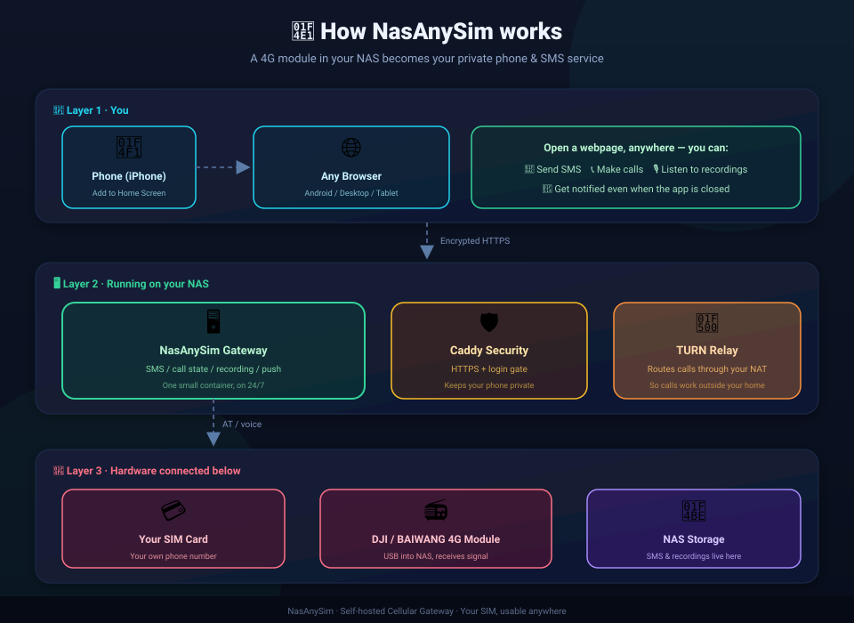

<div align="center">

# 📡 NasAnySim

**Turn a 4G module plugged into your NAS into a private phone & SMS gateway — reachable from any browser.**

[简体中文](README.md) · [English](README.en.md)


---

</div>

## ✨ Overview

NasAnySim is a **self-hosted cellular gateway** that runs on an ARM Linux NAS (fnOS / OpenMediaVault / Debian all work).

Plug in a **DJI / BAIWANG 4G module** (Quectel-compatible AT) with a SIM card, and the gateway turns that SIM into:

> 📱 **Private phone** · 💬 **SMS** · 🔔 **Incoming-call/SMS notifications** · 🎙 **Call recording**

Reachable from any modern browser (iOS PWA, Android, desktop) — no need to carry a second phone.

<div align="center">



*How it works: phone → NAS gateway → 4G module & SIM*

</div>

---

## 🚀 Features

| Feature | Description |
|---------|-------------|
| 📱 SMS | Full conversation UI, durable store, multi-device sync |
| 📞 Voice calls | WebRTC inbound/outbound, TURN relay for NAT traversal |
| 🔔 Background push | Incoming call & SMS notifications even when the PWA is closed |
| 🎙 Call recording | Recorded on the NAS, playable/deletable from the PWA |
| 🔐 Secure auth | Persistent cookie auth, works behind Caddy forward_auth |
| 🐳 One-command deploy | Single ARM64 container, `docker compose up` and go |

---

## ⚖️ Licensing & Distribution

> **Closed-source · Image-only distribution · Free for personal use · No commercial resale**

This project ships as **prebuilt ARM64 Docker images only**. The source is **not published**; the images are **free for personal use but not for commercial resale or redistribution**.

**Why closed-source:** the early USB/AT/eSIM/modem-management foundation derives from **VoHive / DJOneHub** ([github.com/iniwex5/vohive](https://github.com/iniwex5/vohive)) under its own **"Changes and New Works License"**; the UAC probing and QDC507 audio path reference **MaVo** ([github.com/moluncn/mavo](https://github.com/moluncn/mavo), MIT) and similar public projects. These upstream obligations constrain how derivatives may be redistributed.

Full notices: [THIRD_PARTY_NOTICES.md](THIRD_PARTY_NOTICES.md).

**Terms of use:** free for personal self-hosted use; **commercial resale, rebranding-for-sale, and redistribution of the images or their contents are prohibited.**

---

## 📦 Deployment

### Prerequisites

| Item | Requirement |
|------|-------------|
| 🖥 NAS | ARM64 Linux + Docker (fnOS / rk35xx verified) |
| 📶 4G module | DJI / BAIWANG module with SIM, enumerated as `/dev/ttyUSB2` |
| ⚙️ System | **ModemManager must be disabled** |
| 🌐 Network | A domain + HTTPS (Caddy) + TURN relay (required for voice) |

### Quick start (recommended · one-command deploy)

Download the script and run a single command:

```bash
# Download the deploy script
curl -fsSL https://raw.githubusercontent.com/mccding/NasAnySim/main/deploy/deploy.sh -o deploy.sh

# One-command deploy (domain + email; email auto-issues the HTTPS cert)
bash deploy.sh your-domain.example.com you@example.com
```

The script automatically: creates data dirs, generates secrets, configures the Caddy reverse proxy + HTTPS cert, and starts the gateway and TURN relay. When done, open:

```
https://your-domain:7577/remote/     # default login admin / admin
```

> ⚠️ **Change the default password immediately after first login.**

### Manual deploy (optional)

Prefer full control? Follow the steps below:

### Step 1: Create the working directory

```bash
mkdir -p /mnt/docker-compose/maccellular && cd /mnt/docker-compose/maccellular
```

### Step 2: Generate a session secret

```bash
openssl rand -base64 48 > data/auth/session-secret
chmod 600 data/auth/session-secret
```

### Step 3: Save the compose file

Save the content below as `compose.yaml`:

<details>
<summary>📄 Click to expand the full docker-compose.yaml</summary>

```yaml
services:
  nasany-sms:
    image: mccdingding/nasany-sms:latest   # ARM64 image
    container_name: nasany-sms
    restart: unless-stopped
    network_mode: host
    devices:
      - /dev/ttyUSB2:/dev/ttyUSB2       # 4G module AT port
      - /dev/snd:/dev/snd               # ALSA PCM for module voice (UAC)
    volumes:
      - ./data:/var/lib/maccellular     # persistent SMS / auth / recordings
      - ./turn-secret:/run/secrets/turn-secret:ro
    cap_drop:
      - ALL
    security_opt:
      - no-new-privileges:true
    command:
      - -listen
      - 127.0.0.1:7576
      - -port
      - /dev/ttyUSB2
      - -phone-relay-runtime
      - -sms-store
      - /var/lib/maccellular
      - -call-history-store
      - /var/lib/maccellular/call-history.json
      - -remote-listen
      - 127.0.0.1:7578
      - -remote-host
      - localhost
      - -remote-control
      - -remote-allow-loopback
      - -remote-recordings-dir
      - /var/lib/maccellular/call-recordings
      - -remote-cookie-auth
      - -remote-cookie-auth-password-hash-file
      - /var/lib/maccellular/auth/password-hash
      - -remote-cookie-auth-username-file
      - /var/lib/maccellular/auth/username
      - -remote-cookie-auth-initialized-file
      - /var/lib/maccellular/auth/initialized
      - -remote-cookie-auth-secret-file
      - /var/lib/maccellular/auth/session-secret
      - -remote-media-turn-host
      - your-domain.example.com
      - -remote-media-turn-secret-file
      - /run/secrets/turn-secret
      - -remote-media-turn-udp-port
      - "3478"
      - -remote-incoming-answer
      - -remote-rescue-hangup
      - -remote-push
      - -remote-push-vapid-private-key-file
      - /var/lib/maccellular/vapid-private-key
      - -remote-push-vapid-subject
      - mailto:you@example.com
      - -remote-push-subscriptions-file
      - /var/lib/maccellular/push/subscriptions.json
      - -web-console

  nasany-turn:
    image: coturn/coturn:latest
    container_name: nasany-turn
    restart: unless-stopped
    network_mode: host
    command:
      - -n
      - --realm=your-domain.example.com
      - --listening-port=3478
      - --tls-listening-port=5349
      - --fingerprint
      - --lt-cred-mech
      - --use-auth-secret
      - --static-auth-secret-file=/run/secrets/turn-secret
      - --cert=/etc/coturn/tls/fullchain.pem
      - --pkey=/etc/coturn/tls/privkey.pem
```

</details>

### Step 4: Start

```bash
docker compose up -d
```

### Step 5: Open the PWA

```
https://your-domain:7577/remote/
```

### Reverse proxy (pick one)

The gateway listens on loopback only (`127.0.0.1:7578`). You need an **HTTPS reverse proxy** in front of it for public access and login protection. Choose the option that fits your environment:

**Option A · You already run Caddy / Nginx**

Add one site block to your existing config (Caddy shown; other proxies work the same):

```caddy
https://your-domain:7577 {
    tls /etc/ssl/fullchain.pem /etc/ssl/privkey.pem

    # Login/logout reachable without a session
    handle /remote/auth/* {
        reverse_proxy 127.0.0.1:7578 { header_up Host localhost }
    }

    # PWA icons/manifest reachable without a session (iOS "Add to Home Screen")
    handle /remote/*.png { reverse_proxy 127.0.0.1:7578 { header_up Host localhost } }
    handle /remote/*.svg { reverse_proxy 127.0.0.1:7578 { header_up Host localhost } }
    handle /remote/manifest.webmanifest { reverse_proxy 127.0.0.1:7578 { header_up Host localhost } }

    # Everything else requires login
    handle {
        forward_auth 127.0.0.1:7578 {
            uri /api/remote/v1/auth/check
            header_up Host localhost
        }
        reverse_proxy 127.0.0.1:7578 { header_up Host localhost }
    }
}
```

> 💡 No cert file? Replace `tls` with `tls your@email.com` and Caddy will issue a Let's Encrypt certificate automatically.

**Option B · No reverse proxy yet (greenfield)**

Add a dedicated Caddy container that serves only NasAnySim — `docker compose up` handles HTTPS + auth for you:

```yaml
  caddy:
    image: caddy:2-alpine
    container_name: nasany-caddy
    restart: unless-stopped
    network_mode: host        # shares the network with nasany-sms → can reach 127.0.0.1:7578
    volumes:
      - ./caddy:/etc/caddy
      - caddy_data:/data
    command: caddy run --config /etc/caddy/Caddyfile
```

Then create `./caddy/Caddyfile` (listens on 7577):

```caddy
https://your-domain:7577 {
    tls your@email.com    # auto-issued Let's Encrypt cert
    handle /remote/auth/* {
        reverse_proxy 127.0.0.1:7578 { header_up Host localhost }
    }
    handle /remote/*.png { reverse_proxy 127.0.0.1:7578 { header_up Host localhost } }
    handle /remote/*.svg { reverse_proxy 127.0.0.1:7578 { header_up Host localhost } }
    handle /remote/manifest.webmanifest { reverse_proxy 127.0.0.1:7578 { header_up Host localhost } }
    handle {
        forward_auth 127.0.0.1:7578 {
            uri /api/remote/v1/auth/check
            header_up Host localhost
        }
        reverse_proxy 127.0.0.1:7578 { header_up Host localhost }
    }
}
```

> 💡 `tls your@email.com` auto-issues a Let's Encrypt certificate (your domain must resolve to the NAS public IP). The `caddy_data` volume persists certificates.

---

## 🔌 Ports

| Port | Binding | Service | Purpose |
|------|---------|---------|---------|
| `7577` | public (Caddy) | HTTPS PWA | `https://your-domain:7577/remote/` |
| `7578` | 127.0.0.1 | Remote gateway | reverse-proxy target, not public |
| `7576` | 127.0.0.1 | Local console | loopback diagnostics |
| `3478` | public (TURN) | TURN UDP/TCP | WebRTC voice relay (required for calls) |
| `5349` | public (TURN) | TURN TLS | WebRTC voice relay (encrypted) |

---

## 🔐 Authentication

### First login

A fresh deployment seeds the default credential **`admin` / `admin`**.

> ⚠️ **Change the password immediately after your first login.** Do not leave the default credential on a public-facing deployment.

### Change the password (terminal)

SSH into the NAS and run:

```bash
# Reset the login password
docker exec nasany-sms /usr/local/bin/djonehub-macos \
  -remote-reset-password "YOUR_NEW_PASSWORD" \
  -remote-reset-password-file /var/lib/maccellular/auth/password-hash

# Reset the login username
docker exec nasany-sms /usr/local/bin/djonehub-macos \
  -remote-reset-username "YOUR_NEW_USERNAME" \
  -remote-reset-username-file /var/lib/maccellular/auth/username
```

> ⚠️ After resetting, **restart the container** (`docker compose restart nasany-sms`) for the new credentials to take effect.

---

## ⚙️ Module Setup

On connect, the gateway **configures the module automatically** — no manual AT commands needed:

- ✅ **CLCC mode 0 only** — tracks only real voice calls
- ✅ **ModemManager disabled** — the module's serial port is exclusively owned by the gateway
- ✅ **USB composition query** — `AT+QCFG="USBCFG"` verifies the voice-capable profile
- ✅ **PCM/DAI voice routing** — `AT+QPCMV` / `AT+QDAI` verified
- ✅ **UAC + QDC507 audio** — module-side runtime pushed via ADB after reboot; voice route auto-started

**Required module environment:** enumerated as `/dev/ttyUSB2` · ModemManager disabled · SIM registered · TURN relay reachable

---

## 📱 Mobile install (iOS PWA)

1. Open `https://your-domain:7577/remote/` in Safari
2. Log in
3. Share → **Add to Home Screen**
4. Runs as a standalone full-screen PWA

---

## ❓ FAQ

<details>
<summary><b>Why is it closed-source?</b></summary>

Upstream obligations (VoHive's "Changes and New Works License", libusb LGPL, MaVo reference) constrain how derivatives may be redistributed; we distribute images only.
</details>

<details>
<summary><b>Does it work on x86_64?</b></summary>

Currently the image is built for **ARM64** (rk35xx NAS). x86_64 builds may be added later.
</details>

<details>
<summary><b>Which modules are supported?</b></summary>

DJI / BAIWANG modules with the QDC507 voice path (Quectel-compatible AT). The gateway auto-detects the module via USB AT or `/dev/ttyUSB2`.
</details>

<details>
<summary><b>Can I sell this?</b></summary>

No. The images are free for personal self-hosted use; commercial resale and redistribution are prohibited.
</details>

---

## 🙏 Acknowledgements

- **VoHive / DJOneHub** ([github.com/iniwex5/vohive](https://github.com/iniwex5/vohive)) — early USB/AT, eSIM, and modem-management foundation. `Required Notice: Copyright iniwex5`
- **MaVo** ([github.com/moluncn/mavo](https://github.com/moluncn/mavo), MIT) — UAC probing and QDC507 audio-path reference
- **Celldock** and similar public projects — technical reference
- **Pion WebRTC** (MIT), **libusb** (LGPL-2.1), **coturn** — runtime dependencies

Full notices: [THIRD_PARTY_NOTICES.md](THIRD_PARTY_NOTICES.md)

---

## 💖 Support

If this project is useful to you, consider supporting its development:

<div align="center">


*Scan to support*

</div>
