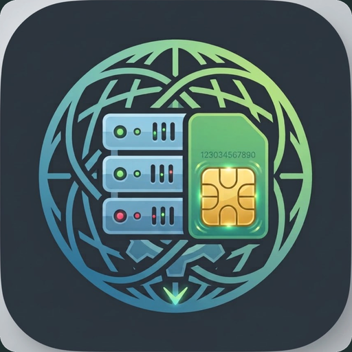
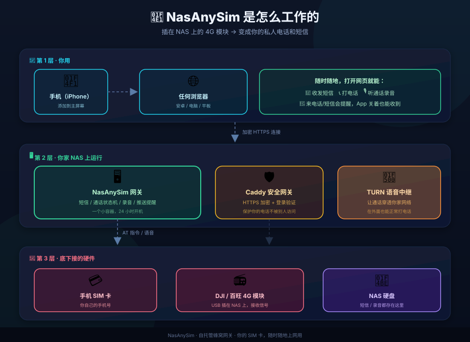

<div align="center">



# NasAnySim

**把插在 NAS 上的 4G 模块，变成可从手机浏览器访问的私人电话与短信网关。**

[简体中文](README.md) · [English](README.en.md) · [更新记录](CHANGELOG.zh-CN.md)

[](https://hub.docker.com/r/mccdingding/nasany-sms)
[](https://hub.docker.com/r/mccdingding/nasany-sms)
[](LICENSE)
[](docs/VERIFICATION.zh-CN.md)

</div>

> **当前发布边界**：本公开仓库只包含文档、部署脚本和发布所需资源；运行时以预编译 Docker 镜像提供。源码、证书、密钥和客户机运行数据不在仓库中。

<div align="center">



*手机浏览器 → HTTPS/Caddy → 网关 → 4G 模块与实体 SIM*

</div>

## 项目简介

NasAnySim 是一个面向自托管场景的蜂窝网关。将 DJI / 百旺（BAIWANG，Quectel-compatible AT）4G 模块插入 Linux NAS，手机浏览器即可使用该 SIM 卡进行短信和电话操作。

- **短信**：收发、会话存储、多端同步
- **电话**：WebRTC 呼入/呼出、TURN 中继、通话录音
- **通知**：来电与短信 Web Push
- **部署**：ARM64 与 amd64 双架构，公开一键脚本自动选择镜像
- **访问**：Caddy HTTPS + 手机 PWA，不要求 Tailscale

> 本项目基于 [MacCellular 1.0.0-rc.4](https://github.com/yuexiazhuojiu-byte/MacCellular) 及相关上游工作改造。版权、许可证和必需声明见 [LICENSE](LICENSE)、[NOTICE](NOTICE) 与 [THIRD_PARTY_NOTICES.md](THIRD_PARTY_NOTICES.md)。

## 一键部署

### 需要准备

| 项目 | 要求 |
|---|---|
| 主机 | Linux ARM64 或 amd64，已安装 Docker Compose |
| 硬件 | 支持的 4G 模块、实体 SIM、USB 连接；本项目验证过 DJI / 百旺 QDC507 语音路径 |
| 域名 | 指向主机公网 IP 的域名；家庭宽带推荐 DuckDNS |
| 权限 | 首次部署需要 root 或可用的 `sudo`，脚本会自动处理主机 ADB 与串口占用 |

### 第一步：检测 USB 串口、架构和音频设备

不要直接假定每台主机都是 `/dev/ttyUSB2`。先运行：

```bash
bash deploy.sh --detect-tty
```

脚本会只读检查并列出：

- 主机架构（`arm64` / `amd64`）
- `ttyUSB` / `ttyACM` 设备、VID:PID 和稳定的 `udev` 路径（若系统提供）
- 2c7c:0125 / Quectel-compatible USB 设备
- ALSA 采集与播放设备
- 当前 ADB transport

它会给出一个串口候选值。若存在多个串口，请按实际硬件确认 AT 口，再将该路径作为第三个参数传给部署脚本。

### 第二步：下载脚本并部署

```bash
mkdir -p nasanysim && cd nasanysim
curl -fsSL https://raw.githubusercontent.com/mccding/NasAnySim/main/deploy/deploy.sh -o deploy.sh
chmod 700 deploy.sh

# 把 /dev/ttyUSB2 换成 --detect-tty 输出的实际 AT 串口
bash deploy.sh nasanysim.duckdns.org your@email.com /dev/ttyUSB2
```

用户**不需要手工编辑脚本、手工 chmod coturn、手工复制证书或手工启动 ADB**。脚本会自动：

1. 检查 Docker、主机架构和串口；
2. 安装/启动仅监听 `localhost:5037` 的 host ADB，并等待它真正就绪；
3. 停止会抢占模块的 ModemManager（若系统存在）；
4. 生成数据密钥、TURN 配置和模块 bootstrap capability；
5. 自动处理 coturn `nobody` 用户所需的目录、配置和证书可读权限；
6. 按架构拉取 `mccdingding/nasany-sms:arm64` 或 `:amd64`；
7. 启动网关、TURN、Caddy 三个容器，并强制重建 TURN 以应用新证书；
8. 自动重试模块 bootstrap，直到后端和模块运行时都报告 ready。

完成后访问：

```text
https://你的域名:7577/remote/
```

新部署默认登录为 `admin / admin`。首次登录后请立即修改密码。

## HTTPS 与证书选择

脚本按以下顺序处理证书：

1. 如果部署目录已有 `caddy/fullchain.pem` 和 `caddy/privkey.pem`，使用用户提供的证书；
2. 如果公网 HTTP-01 条件满足，使用 Let's Encrypt HTTP-01；
3. 如果提供 DuckDNS token，使用 Let's Encrypt DNS-01，**不依赖公网 80 端口**；
4. 如果没有可用的真实证书路径，脚本明确失败，不使用容易误导用户的自签名证书作为正式部署结果。

家庭宽带经常无法使用 HTTP-01，因此推荐 DuckDNS DNS-01。交互式终端会提示输入 token；SSH、CI 等非交互环境请使用 `.env`：

```bash
umask 077
printf '%s\n' 'NASANY_DUCKDNS_TOKEN=[REDACTED]' > .env
chmod 600 .env
# 将 [REDACTED] 在本机替换为真实 token；不要提交 .env
bash deploy.sh nasanysim.duckdns.org your@email.com /dev/ttyUSB2
```

## 内置 DuckDNS 自动更新

DuckDNS 动态 IP 更新已经内置在一键脚本里，**不需要用户另外下载 updater 或自己写 cron**。当满足以下条件时自动启用：

- 域名是 `*.duckdns.org`；
- 部署时提供了 `NASANY_DUCKDNS_TOKEN`（交互输入、`.env` 或环境变量均可）。

部署脚本会：

1. 在当前部署目录生成 `duckdns-update.sh`；
2. 将 updater 权限设为 `700`，因为该文件包含 token，只有部署用户可执行/读取；
3. 默认使用 DuckDNS 的 `ip=` 源地址检测，让 DuckDNS 根据请求来源更新公网 IP；
4. 如果明确设置 `NASANY_PUBLIC_IP`，则固定使用该 IP；
5. 写入每 5 分钟执行一次的 crontab；
6. 将 DuckDNS 返回结果记录到 `/var/log/duckdns-update.log`。

检查自动更新是否安装：

```bash
crontab -l | grep duckdns-update
ls -l duckdns-update.sh       # 应为 owner-only（700）
./duckdns-update.sh            # 可手工触发一次
```

`NASANY_PUBLIC_IP` 只在你明确需要绕过代理/TUN 的源地址识别时设置；否则留空即可。自有域名（非 DuckDNS）不会错误安装 DuckDNS updater，应使用该域名服务商自己的 DDNS 机制。完整流程见 [DuckDNS 专项说明](docs/DUCKDNS.zh-CN.md)。

> **安全提示**：`.env`、`duckdns-update.sh`、证书和私钥都属于本机敏感文件。不要上传、复制给他人或粘贴到公开 issue；如果 token 曾经暴露，请在 DuckDNS 控制台轮换。

## 公网端口与安全边界

以下公网端口需要转发到运行 NasAnySim 的主机 LAN IP：

| 端口 | 协议 | 用途 | 要求 |
|---:|:---:|---|---|
| `7577` | TCP | HTTPS PWA 与远程网关 | 必须 |
| `3478` | UDP | TURN 初始连接 | 必须 |
| `49160-49167` | UDP | TURN relay 音频数据 | 通话必须 |
| `5349` | TCP | TURN TLS | 启用 TLS 证书时建议放行 |

以下端口只能在本机或容器内部使用，**不要暴露到公网**：

| 端口 | 绑定 | 用途 |
|---:|---|---|
| `7576` | `127.0.0.1` | 后端管理/诊断接口 |
| `7578` | `127.0.0.1` | Caddy 反代目标 |
| `5037` | `localhost` | host ADB server |

只转发 `7577` 而遗漏 `49160-49167/UDP`，常见结果是网页能打开但通话提示“无法连接公网中继”。完整端口表见 [端口与安全边界](docs/PORTS.zh-CN.md)。

## 已有 Caddy/Nginx 或端口冲突

默认部署包含 Caddy 容器。如果宿主机的 `7577` 已由现有反向代理占用，不要让两个服务抢同一个端口：

```bash
NASANY_SKIP_CADDY=1 bash deploy.sh 你的域名 your@email.com /dev/ttyUSB2
```

脚本会生成 `caddy/Caddyfile`，可将站点逻辑整合到你现有的 Caddy/Nginx。不要因此把 `7576`、`7578` 或 `5037` 直接转发到公网。

## 架构与镜像

| 主机架构 | Docker Hub 镜像 |
|---|---|
| ARM64 / AArch64 | `mccdingding/nasany-sms:arm64` |
| amd64 / x86_64 | `mccdingding/nasany-sms:amd64` |

脚本自动选择架构，不能在 ARM64 主机手工使用 amd64 镜像，也不能反过来使用。运行时镜像为闭源预编译分发；本仓库不会包含源码、Go 缓存、客户机证书或构建上下文。

## 手机使用

1. 用 Safari 或 Chrome 打开 `https://你的域名:7577/remote/`；
2. 登录并修改默认密码；
3. iPhone 选择“分享 → 添加到主屏幕”，Android 可使用浏览器菜单安装 PWA；
4. 首次通话前确认路由器已转发 TURN 端口范围。

## 故障排查

- **没有串口**：重新运行 `bash deploy.sh --detect-tty`，确认模块 USB 连接和实际 AT 串口；
- **网页打不开**：检查 `7577/TCP`、域名解析和 Caddy 容器日志；
- **网页能开但无法连接中继**：检查 `3478/UDP`、`49160-49167/UDP`，并优先确认 `5349/TCP` 与证书；
- **证书申请失败**：家庭宽带使用 DuckDNS token 走 DNS-01，不要反复重试 HTTP-01；
- **ADB 报错**：脚本应自动安装并绑定 `localhost:5037`，检查 `systemctl status nasany-adb-server.service`；
- **ModemManager 抢串口**：脚本会自动停用；若发行版没有 systemd，手工确认没有其他进程打开 TTY。

更多处理步骤见 [故障排查](docs/TROUBLESHOOTING.zh-CN.md)。

## 验证状态

本次发布候选已完成 ARM64 与 amd64 清洁环境验收：从 Docker Hub 拉取镜像、DNS-01 证书、TURN TLS 5349、host ADB loopback、模块 bootstrap/语音运行时，以及真实电话/短信闭环均已验证。详细记录见 [双架构验收记录](docs/VERIFICATION.zh-CN.md)。

## 许可证与致谢

本项目以预编译 Docker 镜像形式发布，个人自托管使用免费；禁止商用倒卖、改皮转卖和再分发镜像及其内容。完整条款以 [LICENSE](LICENSE) 为准。

感谢以下上游与参考项目：

- [MacCellular](https://github.com/yuexiazhuojiu-byte/MacCellular)：早期 macOS 短信/电话网关；
- [VoHive / DJOneHub](https://github.com/iniwex5/vohive)：早期 USB/AT、eSIM 与模块管理基础；
- [MaVo](https://github.com/moluncn/mavo)：UAC 探测与 QDC507 音频路径参考；
- Pion WebRTC、libusb、coturn 及其他运行时依赖。

完整声明见 [NOTICE](NOTICE) 与 [THIRD_PARTY_NOTICES.md](THIRD_PARTY_NOTICES.md)。
